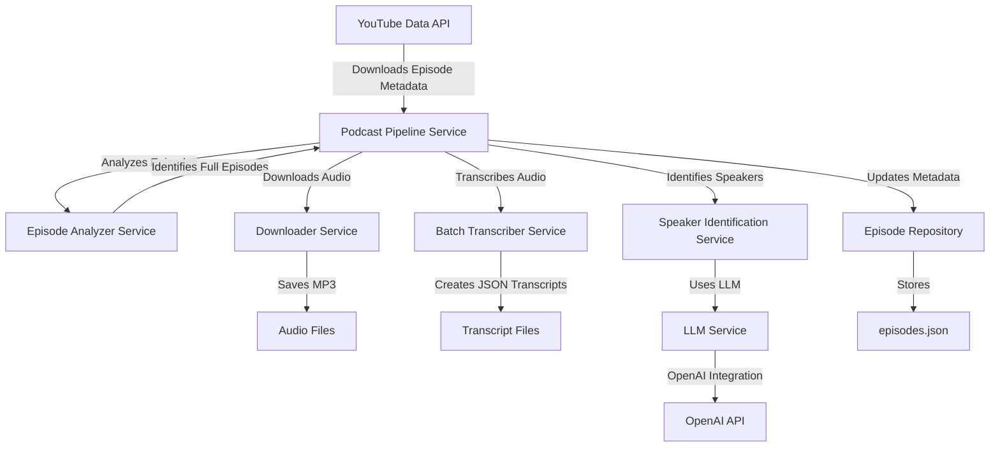

# AllInVault Architecture

## System Overview

AllInVault is a comprehensive podcast analysis platform designed to download, process, transcribe, and analyze podcast episodes. The system follows a modular, service-oriented architecture that adheres to SOLID principles for maintainability and extensibility.

## Core Components

```
┌───────────────────┐     ┌─────────────────┐     ┌───────────────────┐
│                   │     │                 │     │                   │
│  Episode Retrieval│─────▶ Audio Processing│─────▶    Transcription  │
│                   │     │                 │     │                   │
└───────────────────┘     └─────────────────┘     └───────────────────┘
          │                       │                        │
          │                       │                        │
          ▼                       ▼                        ▼
┌───────────────────┐     ┌─────────────────┐     ┌───────────────────┐
│                   │     │                 │     │                   │
│  Metadata Storage │     │  Audio Storage  │     │ Transcript Storage│
│                   │     │                 │     │                   │
└───────────────────┘     └─────────────────┘     └───────────────────┘
```

## Project Structure

```
AllInVault/
├── data/                       # Data storage
│   ├── audio/                  # Downloaded audio files
│   ├── json/                   # Metadata storage
│   └── transcripts/            # Transcript storage
├── src/                        # Source code
│   ├── cli/                    # Command-line interfaces
│   │   ├── analyze_episodes_cmd.py  # CLI for episode analysis
│   │   ├── display_transcript_cmd.py # CLI for transcript display
│   │   ├── download_podcast_cmd.py  # CLI for podcast download
│   │   ├── process_podcast_cmd.py   # CLI for full pipeline
│   │   ├── transcribe_audio_cmd.py  # CLI for audio transcription
│   │   └── transcribe_full_episodes_cmd.py # CLI for batch transcription
│   ├── models/                 # Data models
│   │   └── podcast_episode.py  # Podcast episode model
│   ├── repositories/           # Data access layer
│   │   └── episode_repository.py # Episode repository
│   ├── services/               # Business logic
│   │   ├── youtube_service.py  # YouTube API service
│   │   ├── downloader_service.py # Audio downloader service
│   │   ├── transcription_service.py # Transcription service
│   │   ├── episode_analyzer.py # Episode analysis service
│   │   ├── batch_transcriber.py # Batch transcription service
│   │   └── podcast_pipeline.py # Full pipeline orchestration
│   └── utils/                  # Utilities
│       └── config.py           # Configuration utilities
├── analyze_episodes.py         # Entry point for episode analysis
├── display_transcript.py       # Entry point for transcript display
├── download_podcast.py         # Entry point for podcast download
├── process_podcast.py          # Entry point for full pipeline
├── transcribe_audio.py         # Entry point for audio transcription
└── transcribe_full_episodes.py # Entry point for batch transcription
```

## Data Flow and Integration

### YouTube to Transcript Information Flow

1. **YouTube Metadata Retrieval**:
   - `YouTubeService` fetches podcast episode metadata from YouTube API
   - Extracts key information: title, description, duration, publish date, statistics

2. **Episode Analysis**:
   - `EpisodeAnalyzerService` categorizes episodes as FULL or SHORT based on duration
   - Updates metadata in the repository with duration in seconds and episode type

3. **Audio Processing**:
   - `DownloaderService` downloads audio files for selected episodes
   - Audio files are stored in the audio directory with standardized filenames
   - Episode objects are updated with audio_filename references

4. **Transcription**:
   - `DeepgramTranscriptionService` processes audio files and generates transcripts
   - Transcript JSON contains detailed information including:
     - Word-by-word timestamps
     - Speaker diarization
     - Utterance boundaries
     - Full transcript duration
   - Metadata fields are updated in the episode object:
     - `transcript_filename`: Path to stored transcript
     - `transcript_duration`: Duration of the transcribed content in seconds
     - `transcript_utterances`: Count of utterances in the transcript
     - `speaker_count`: Number of unique speakers identified

5. **Repository Updates**:
   - `EpisodeRepository` saves all metadata changes back to persistent storage
   - Ensures data consistency between YouTube metadata and transcript information

### Critical Integration Points

1. **Duration Synchronization**:
   - YouTube provides duration in ISO 8601 format (e.g., "PT1H25M30S")
   - Transcription service provides duration in seconds
   - `EpisodeAnalyzerService` converts YouTube duration to seconds for comparison

2. **Transcript Completeness**:
   - System compares `duration_seconds` (from YouTube) with `transcript_duration`
   - Calculates and stores coverage percentage in episode metadata
   - Flags incomplete transcripts for further processing

3. **Metadata Enrichment**:
   - Original YouTube metadata is preserved in the episode model
   - Transcript-related metadata is added to the same model
   - Updates are made via repository to ensure persistence

## Service Layer

### 1. Episode Retrieval Services

**Key Components:**
- `YouTubeService`: Fetches podcast episodes from YouTube
  - Retrieves metadata via the YouTube API
  - Converts YouTube API responses to `PodcastEpisode` objects
  - Extracts duration, title, description, and other video metadata

### 2. Audio Processing Services

**Key Components:**
- `DownloaderService`: Downloads audio content
  - Uses yt-dlp for efficient YouTube downloads
  - Handles audio format configuration
  - Manages file naming and storage

### 3. Episode Analysis Service

**Key Components:**
- `EpisodeAnalyzerService`: Analyzes episodes based on metadata
  - Duration-based filtering to separate full episodes from shorts
  - ISO 8601 duration parsing for accurate duration comparison
  - Detailed episode information and statistics

### 4. Transcription Services

**Key Components:**
- `TranscriptionService`: Core transcription functionality
  - Speaker diarization to identify different speakers
  - Timestamp generation for utterances
  - Transcript metadata enrichment with episode information
- `DeepgramTranscriptionService`: Implementation using Deepgram API
  - Utilizes Deepgram Nova-3 model for improved accuracy
  - Configurable transcription parameters
  - Updates episode objects with transcript information
- `BatchTranscriberService`: Manages transcription of multiple episodes
  - Coordinates batch processing of episodes
  - Generates both JSON and human-readable transcripts

### 5. Orchestration Service

**Key Components:**
- `PodcastPipelineService`: Orchestrates the entire workflow
  - Coordinates all other services in sequence
  - Manages the complete pipeline from download to transcription
  - Provides unified interface for the entire process

## Data Models

### PodcastEpisode

The central data model representing a podcast episode with fields for both YouTube metadata and transcript information:

```
PodcastEpisode
├── video_id: str                     # YouTube video ID
├── title: str                        # Episode title
├── description: str                  # Episode description
├── published_at: datetime            # Publication date
├── channel_id: str                   # YouTube channel ID
├── channel_title: str                # Channel name
├── tags: List[str]                   # Video tags
├── duration: str                     # ISO 8601 duration from YouTube
├── view_count: int                   # View count
├── like_count: int                   # Like count
├── comment_count: int                # Comment count
├── thumbnail_url: str                # Thumbnail URL
├── audio_filename: str               # Path to audio file
├── transcript_filename: str          # Path to transcript file
├── transcript_duration: float        # Duration of transcript in seconds
├── transcript_utterances: int        # Number of utterances in transcript
├── speaker_count: int                # Number of speakers
└── metadata: Dict                    # Additional metadata
    ├── type: str                     # FULL or SHORT
    ├── duration_seconds: int         # Duration in seconds
    └── coverage_percentage: float    # Transcript coverage
```

## Repository Layer

**Key Components:**
- `EpisodeRepository`: Data access for episodes
  - JSON-based storage for all episode data
  - CRUD operations for episode management
  - Ensures data persistence between pipeline stages

## Command-Line Interface

The system provides multiple entry points for different tasks:

1. **Individual Tools**:
   - `analyze_episodes.py`: Analyze and categorize episodes
   - `download_podcast.py`: Download episode metadata and audio
   - `transcribe_audio.py`: Transcribe audio files
   - `transcribe_full_episodes.py`: Batch transcribe full episodes
   - `display_transcript.py`: View formatted transcripts

2. **Unified Pipeline**:
   - `process_podcast.py`: Execute the complete pipeline in one command

## System Architecture Diagram

```
┌─────────────────┐    ┌─────────────────┐    ┌────────────────────┐
│                 │    │                 │    │                    │
│  YouTube API    │───►│ Audio Download  │───►│ Deepgram API       │
│                 │    │                 │    │                    │
└─────────────────┘    └─────────────────┘    └──────────┬─────────┘
        │                                                 │
        │                                                 │
        ▼                                                 ▼
┌─────────────────┐    ┌─────────────────┐    ┌────────────────────┐
│                 │    │                 │    │                    │
│ Episode Model   │◄───┤ Repository      │◄───┤ Transcript Model   │
│                 │    │                 │    │                    │
└─────────────────┘    └──────┬──────────┘    └────────────────────┘
                              │
                              │
                      ┌───────▼────────┐
                      │                │
                      │ Command-Line   │
                      │ Interface      │
                      │                │
                      └────────────────┘
```

## Known Issues and Improvements

### YouTube Metadata and Transcript Integration

There was a concern that YouTube information metadata was not getting updated properly from transcript information. The investigation reveals:

1. **Current Behavior**:
   - In `transcription_service.py`, the `transcribe_episode` method correctly updates:
     - `episode.transcript_filename`
     - `episode.transcript_duration`
     - `episode.transcript_utterances`
   
   - These updates are temporary unless explicitly saved back to the repository

2. **Issue**:
   - In `batch_transcriber.py`, the episode objects are correctly updated with transcript information
   - However, in some cases, `self.repository.update_episode(episode)` might not be called or is failing

3. **Solution**:
   - Ensure all episode updates are properly persisted to the repository
   - Verify that `PodcastPipelineService.transcribe_audio` properly reloads episodes after transcription
   - Add explicit repository update calls after critical operations

## Future Enhancements

- **Improved Metadata Integration**: Better synchronization between YouTube and transcript data
- **Speaker Recognition**: Advanced speaker identification using voice signatures
- **Content Analysis**: Natural language processing for topic extraction and summarization
- **Web Interface**: User-friendly interface for browsing and searching transcripts

## Speaker Identification System

The Speaker Identification System is designed to automatically identify and map anonymous speakers in podcast transcripts to their actual names. This is a critical component for making the transcript content searchable and analyzable by speaker.

### Speaker Identification Strategies

The system employs multiple complementary strategies to achieve accurate speaker identification:

1. **LLM-Based Identification (New)**
   - Uses Large Language Models (OpenAI or DeepSeq) to analyze episode metadata and transcript
   - Extracts hosts and guests with confidence scores
   - Provides highly accurate identification from contextual understanding
   - Configurable through CLI and pipeline service parameters

2. **Metadata-Based Identification**
   - Extracts potential guest names from episode titles and descriptions
   - Uses patterns like "with Guest Name" or "featuring Guest Name"
   - Filters out known hosts to identify unique guests

3. **Self-Introduction Detection**
   - Identifies speakers introducing themselves with patterns like "I'm [name]" or "This is [name]"
   - Analyzes intro sections where hosts and guests typically introduce themselves
   - Assigns high confidence scores to these identifications

4. **Direct Address Analysis**
   - Detects when one speaker directly addresses another by name
   - Analyzes response patterns to map speaker IDs to names
   - Uses frequency analysis to determine the most likely mapping

5. **Speaking Pattern Recognition**
   - Analyzes linguistic patterns unique to specific speakers
   - Identifies characteristic filler words and phrases
   - Measures utterance length and speaking style indicators

6. **Name Mention Analysis**
   - Observes how speakers refer to others vs. themselves
   - Uses the insight that people rarely refer to themselves by name
   - Maps speakers who are frequently mentioned but don't mention themselves

7. **Intro/Outro Context**
   - Examines podcast introductions and conclusions
   - Uses the structural patterns of podcast episodes
   - Identifies hosts who typically begin or end episodes

8. **Cross-Episode Learning**
   - Maintains speaker history across episodes
   - Improves identification accuracy over time
   - Placeholder for future speaker fingerprinting

### LLM Integration Architecture

The LLM integration follows a modular design with:

1. **LLM Service Layer**
   - Abstract `LLMProvider` interface for different model implementations
   - Concrete providers for OpenAI and DeepSeq
   - Configurable models and parameters
   - Structured JSON output format for consistent processing

2. **Integration with Existing Pipeline**
   - Optional LLM usage controlled via configuration
   - LLM identification runs first when enabled
   - Results are combined with traditional heuristic methods
   - Confidence scores determine which identification to trust

3. **CLI Configuration**
   - Command-line parameters for enabling/configuring LLM
   - Provider selection (OpenAI/DeepSeq)
   - Model selection for each provider
   - Filtering options for reviewing results

### Speaker Metadata Structure

Identified speakers are stored in the episode metadata with rich information:

```json
"speakers": {
  "0": {
    "name": "Jason Calacanis",
    "utterance_count": 120,
    "confidence": 0.92,
    "is_guest": false,
    "is_unknown": false,
    "identified_by_llm": true
  },
  "1": {
    "name": "Guest Name",
    "utterance_count": 85,
    "confidence": 0.78,
    "is_guest": true,
    "is_unknown": false,
    "identified_by_llm": true
  },
  "2": {
    "name": "Unknown Speaker 2",
    "utterance_count": 5,
    "confidence": 0.1,
    "is_guest": false,
    "is_unknown": true,
    "identified_by_llm": false
  }
}
```

### Confidence Scoring

The system assigns confidence scores to each identification:

- Each identification strategy contributes to the overall confidence score
- Higher confidence is given to more reliable methods (LLM, self-introductions, direct address)
- Identifications below threshold confidence are marked as "Unknown Speaker"
- Guest speakers are explicitly flagged in the metadata

### Implementation Details

The speaker identification process follows these steps:

1. Extract all unique speaker IDs from the transcript
2. If enabled, use LLM to identify speakers from episode metadata and transcript sample
3. Apply traditional identification strategies in sequence, from most to least reliable
4. Combine evidence from all strategies with weighted confidence scores
5. For remaining unidentified speakers, apply heuristic defaults based on podcast format
6. Update episode metadata with detailed speaker information including confidence scores

### Future Enhancements

Planned improvements to the speaker identification system:

1. **Speaker Embedding/Voice Fingerprinting**
   - Create voice fingerprints for known speakers
   - Train models to recognize speakers across episodes
   - Leverage audio characteristics for more accurate identification

2. **Enhanced NLP Analysis**
   - Use more sophisticated NLP for entity recognition in transcripts
   - Analyze topic expertise patterns to match with known speakers
   - Implement advanced contextual analysis

3. **External Knowledge Integration**
   - Connect with podcast websites and APIs for guest information
   - Build a growing database of speaker profiles
   - Integrate with public figure databases

4. **Interactive Feedback Loop**
   - Allow manual corrections to improve future identifications
   - Implement active learning from user feedback
   - Build a continuously improving identification system

## Overall System Architecture

The AllInVault system follows SOLID principles throughout its architecture:

1. **Single Responsibility Principle**: Each component has a well-defined responsibility
   - Speaker identification service focuses solely on mapping speakers
   - Episode repository handles persistence
   - Transcript processing handles text formatting

2. **Open/Closed Principle**: Components are open for extension
   - New speaker identification strategies can be added without modifying existing code
   - The confidence scoring system allows for additional evidence sources

3. **Liskov Substitution Principle**: Services use clear interfaces
   - Alternative identification strategies can be substituted
   - Different transcript formats can be processed with the same interface

4. **Interface Segregation**: APIs are focused and specific
   - Speaker identification doesn't depend on unrelated episode features
   - Clear separation between transcript analysis and metadata handling

5. **Dependency Inversion**: High-level modules depend on abstractions
   - Processing pipeline depends on abstract interfaces
   - Services can be swapped with alternative implementations

The system follows a modular architecture with services, repositories, and models clearly separated to maintain clean architecture principles 

