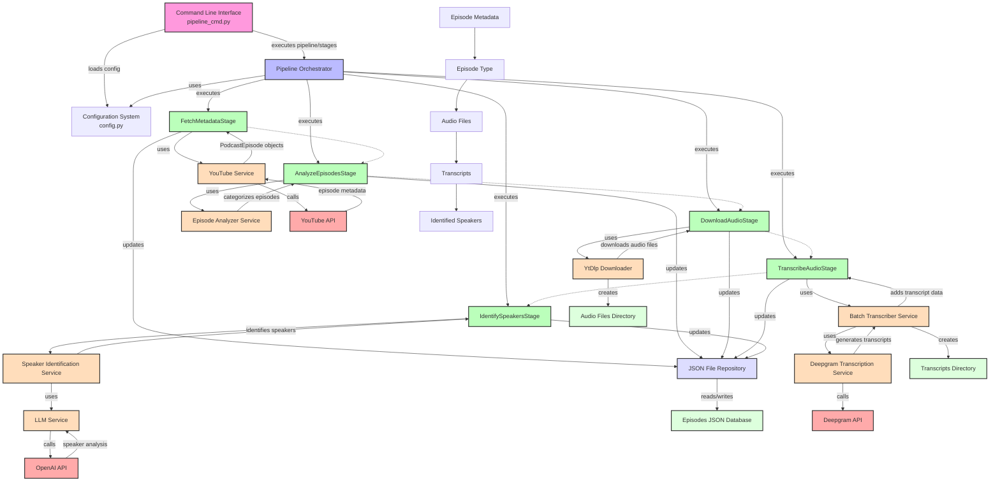

# Podcast Processing Pipeline Architecture

## Overview

The AllInVault podcast processing pipeline is a modular system designed to fetch, analyze, download, transcribe, and process podcast episodes. The architecture follows SOLID principles and employs a clear separation of concerns, making it maintainable, extensible, and easy to understand.

## Components Diagram

```
┌─────────────────────┐          ┌─────────────────────┐
│  Command Line       │          │  Configuration      │
│  Interface (CLI)    │───────┐  │  System             │
└─────────────────────┘       │  └─────────────────────┘
                              │           ▲
                              ▼           │
┌──────────────────────────────────────────────────────┐
│                                                      │
│               Pipeline Orchestrator                  │
│                                                      │
└──────────────────────────────────────────────────────┘
        │            │            │            │
        ▼            ▼            ▼            ▼
┌────────────┐  ┌────────────┐  ┌────────────┐  ┌────────────┐
│  Pipeline  │  │  Pipeline  │  │  Pipeline  │  │  Pipeline  │
│   Stage 1  │  │   Stage 2  │  │   Stage 3  │  │   Stage N  │
└────────────┘  └────────────┘  └────────────┘  └────────────┘
        │            │            │            │
        ▼            ▼            ▼            ▼
┌──────────────────────────────────────────────────────┐
│                                                      │
│                Service Layer                         │
│                                                      │
└──────────────────────────────────────────────────────┘
                              │
                              ▼
┌──────────────────────────────────────────────────────┐
│                                                      │
│                Repository Layer                      │
│                                                      │
└──────────────────────────────────────────────────────┘
                              │
                              ▼
┌──────────────────────────────────────────────────────┐
│                                                      │
│                  Data Storage                        │
│                                                      │
└──────────────────────────────────────────────────────┘
```

## Key Components

### 1. Command Line Interface (CLI)

The CLI (`src/cli/pipeline_cmd.py`) provides a user-friendly interface to:
- Execute specific pipeline stages
- Process all episodes or specific episodes
- Control stage dependencies
- Configure stage-specific parameters
- Display and verify transcripts

### 2. Pipeline Orchestrator

The `PipelineOrchestrator` class manages the execution flow of the pipeline:
- Maintains the state of stage execution
- Ensures dependencies between stages are honored
- Provides flexible execution of individual stages or the full pipeline
- Passes configuration and context between stages

### 3. Pipeline Stages

Each stage is implemented as a separate class following the same interface:
- `FetchMetadataStage`: Fetches episode metadata from external sources
- `AnalyzeEpisodesStage`: Analyzes episodes and categorizes them (full episodes vs shorts)
- `DownloadAudioStage`: Downloads audio for episodes
- `TranscribeAudioStage`: Transcribes audio files to text
- `IdentifySpeakersStage`: Identifies speakers in the transcripts

### 4. Service Layer

The service layer contains specialized services for specific tasks:
- `BatchTranscriberService`: Handles batch transcription of episodes
- `DeepgramTranscriptionService`: Interfaces with Deepgram API for transcription
- `SpeakerIdentificationService`: Identifies speakers in transcripts
- `LLMService`: Provides Large Language Model capabilities

### 5. Repository Layer

The repository layer provides data access abstraction:
- `JsonFileRepository`: Manages episode data storage and retrieval
- Follows the repository pattern for clean data access

### 6. Models

The system uses well-defined data models:
- `PodcastEpisode`: Represents podcast episode data
- `StageResult`: Represents the result of pipeline stage execution

## Data Flow

1. The user initiates a command through the CLI
2. The Pipeline Orchestrator determines which stages to execute based on the command
3. Each stage is executed in sequence, with dependencies honored
4. Each stage fetches required data from the repository, processes it, and updates the repository
5. Results are returned to the orchestrator and eventually to the CLI
6. The CLI displays the results to the user

## Design Principles

The architecture follows several key design principles:

1. **Single Responsibility Principle**: Each component has a single, well-defined responsibility
2. **Open/Closed Principle**: The system is open for extension but closed for modification
3. **Dependency Inversion**: Components depend on abstractions, not implementations
4. **Separation of Concerns**: Clear separation between data access, business logic, and user interface
5. **Modularity**: Components can be replaced or modified independently

## Configuration

The system is configured through a configuration system that loads settings from environment variables and/or configuration files.

## Extensibility

New stages can be added by implementing the `AbstractStage` interface and registering them with the orchestrator.

## Future Improvements

1. Add more robust error handling and retry mechanisms
2. Implement a database repository for better scalability
3. Add a web interface for easier interaction
4. Implement more advanced speaker identification techniques
5. Add support for more transcription providers
6. Implement a caching layer for improved performance

## Detailed Implementation Diagram

Below is a detailed mermaid diagram showing the specific implementation of the pipeline architecture, including all services, stages, and their interactions:

