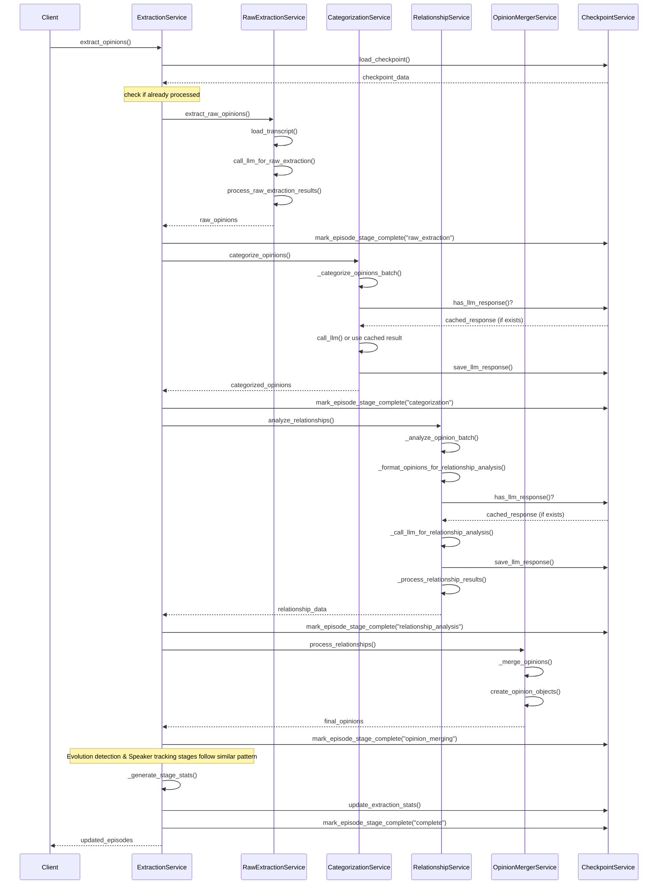

# AllInVault Architecture

This document describes the architecture of the AllInVault system, focusing on the podcast processing pipeline and the opinion extraction feature.

## System Overview

AllInVault is a platform for processing, analyzing, and extracting insights from podcast episodes. The system follows a modular, pipeline-based architecture that processes podcast episodes through several stages, from fetching metadata to extracting opinions.

## Core Architecture Components

### 1. Data Model Layer

- **PodcastEpisode**: Represents a single podcast episode with metadata, audio files, and transcripts
- **Opinion**: Represents an opinion expressed by a speaker in a podcast episode, including details about the speaker, context, and sentiment
- **Category**: Represents a classification for opinions with unique IDs and descriptive information
  - Uses a simple but extensible model with id, name, description, optional parent_id for hierarchical structure, and metadata for additional properties
  - Designed to support both pre-defined categories and user-created categories
  - Implements to_dict/from_dict methods for serialization

### 2. Repository Layer

- **JsonFileRepository**: Manages storage and retrieval of podcast episodes in JSON format
- **OpinionRepository**: Manages storage and retrieval of opinions in JSON format
- **CategoryRepository**: Manages storage and retrieval of opinion categories in JSON format
  - Provides default categories while enabling custom categories
  - Implements methods for finding categories by name (case-insensitive)
  - Supports hierarchical category relationships through parent_id references
  - Handles category creation with unique ID generation

### 3. Service Layer

- **Pipeline Orchestrator**: Manages the execution of the multi-stage pipeline
- **LLM Service**: Provides integration with language models for enhanced analysis
- **Opinion Extractor Service**: Extracts opinions from podcast transcripts using LLM
- **Checkpoint Service**: Manages extraction progress and enables resumable operations
- **Categorization Service**: 
  - Standardizes raw categories to well-defined ones
  - Uses LLM to determine appropriate categories when needed
  - Maintains mapping between raw and standard categories
  - Ensures categories exist in the repository

### 4. CLI Layer

- **Pipeline Command**: Provides a unified command-line interface for running the pipeline

## Pipeline Architecture

The pipeline is designed with a stage-based architecture, where each stage has a clear responsibility and can depend on previous stages:

```
                                           ┌───────────────────┐
                                           │                   │
                                           │  FETCH_METADATA   │
                                           │                   │
                                           └─────────┬─────────┘
                                                     │
                                                     ▼
                                           ┌───────────────────┐
                                           │                   │
                                           │  ANALYZE_EPISODES │
                                           │                   │
                                           └─────────┬─────────┘
                                                     │
                                                     ▼
                                           ┌───────────────────┐
                                           │                   │
                                           │  DOWNLOAD_AUDIO   │
                                           │                   │
                                           └─────────┬─────────┘
                                                     │
                                                     ▼
                                           ┌───────────────────┐
                                           │                   │
                                           │  CONVERT_AUDIO    │
                                           │                   │
                                           └─────────┬─────────┘
                                                     │
                                                     ▼
                                           ┌───────────────────┐
                                           │                   │
                                           │  TRANSCRIBE_AUDIO │
                                           │                   │
                                           └─────────┬─────────┘
                                                     │
                                                     ▼
                                           ┌───────────────────┐
                                           │                   │
                                           │  IDENTIFY_SPEAKERS│
                                           │                   │
                                           └─────────┬─────────┘
                                                     │
                                                     ▼
                                           ┌───────────────────┐
                                           │                   │
                                           │  EXTRACT_OPINIONS │
                                           │                   │
                                           └───────────────────┘
```

### Pipeline Stages

1. **FETCH_METADATA**: Retrieves episode metadata from YouTube API, including titles, descriptions, and publish dates.
2. **ANALYZE_EPISODES**: Analyzes episode metadata to classify and enrich episode information.
3. **DOWNLOAD_AUDIO**: Downloads episode audio files using a downloader service.
4. **CONVERT_AUDIO**: Converts audio to a consistent format suitable for transcription.
5. **TRANSCRIBE_AUDIO**: Transcribes audio into text, creating structured transcript files.
6. **IDENTIFY_SPEAKERS**: Maps speakers in the transcripts to actual identities.
7. **EXTRACT_OPINIONS**: Uses LLM to extract opinions from the transcripts.

## Opinion Categorization System Architecture

The opinion categorization system is a critical component for organizing extracted opinions. It's designed with modularity, extensibility, and performance in mind.

### Category Model Architecture

```
┌─────────────────────────────────────┐
│            Category Model           │
├─────────────────────────────────────┤
│ - id: str                           │
│ - name: str                         │
│ - description: Optional[str]        │
│ - parent_id: Optional[str]          │
│ - metadata: Dict[str, Any]          │
├─────────────────────────────────────┤
│ + to_dict() -> Dict                 │
│ + from_dict(data: Dict) -> Category │
└─────────────────────────────────────┘
              ▲
              │ uses
              │
┌─────────────────────────────────────┐
│        Category Repository          │
├─────────────────────────────────────┤
│ - categories_file_path: str         │
│ - categories: Dict[str, Category]   │
├─────────────────────────────────────┤
│ + get_all_categories()              │
│ + get_category(id)                  │
│ + get_category_by_name(name)        │
│ + find_or_create_category(name)     │
│ + save_category(category)           │
└─────────────────────────────────────┘
              ▲
              │ uses
              │
┌─────────────────────────────────────┐
│    Opinion Categorization Service   │
├─────────────────────────────────────┤
│ - category_repository               │
│ - llm_service                       │
│ - standard_categories               │
│ - category_mapping_cache            │
├─────────────────────────────────────┤
│ + categorize_opinions(raw_opinions) │
│ + _map_to_standard_category(raw)    │
│ + ensure_categories_exist(cats)     │
└─────────────────────────────────────┘
```

### Categorization Flow

1. **Raw Extraction**: Opinions are extracted with initial category labels
2. **Standardization**: Raw categories are mapped to standard categories
3. **Persistence**: Categories are created in the repository if needed
4. **Grouping**: Opinions are grouped by standardized category
5. **Relationship Analysis**: Categorized opinions are analyzed for relationships

```
┌───────────────┐     ┌───────────────┐     ┌───────────────┐     ┌───────────────┐
│               │     │               │     │               │     │               │
│ Raw Opinion   │────►│ Categorization│────►│ Category      │────►│ Categorized   │
│ Extraction    │     │ Mapping       │     │ Storage       │     │ Opinion Groups│
│               │     │               │     │               │     │               │
└───────────────┘     └───────────────┘     └───────────────┘     └───────────────┘
                             │
                             ▼
                      ┌───────────────┐
                      │               │
                      │ LLM Service   │
                      │ (if needed)   │
                      │               │
                      └───────────────┘
```

### Category Optimization Techniques

1. **Caching**: Category mappings are cached to avoid redundant LLM calls
2. **Hierarchical Structure**: Categories support parent-child relationships for organization
3. **Case-Insensitive Matching**: Robust matching of categories regardless of case
4. **Default Categories**: System provides sensible defaults while allowing customization
5. **LLM Assistance**: Uses LLM for intelligent category mapping when direct matches fail

## Enhancements to Category System

### Current Limitations

The current category implementation has some limitations:
- JSON-based storage may not scale to very large numbers of categories
- Limited support for complex hierarchical relationships
- No built-in search capabilities beyond exact name matching
- Limited metadata handling for advanced categorization needs

### Proposed Enhancements

1. **Database Integration**
   - Replace JSON storage with a proper database (SQL or NoSQL)
   - Implement efficient indexing for category lookups
   - Support for transactions and concurrent access

2. **Enhanced Hierarchical Support**
   - Implement proper tree traversal methods
   - Support for multi-level hierarchies with path querying
   - Methods to get all children/descendants of a category

3. **Semantic Category Matching**
   - Integrate embedding-based similarity for fuzzy category matching
   - Pre-compute embeddings for all standard categories
   - Use vector similarity for more intelligent category mapping

4. **Category Search and Discovery**
   - Full-text search capabilities across category names and descriptions
   - Tag-based filtering system for categories
   - Categorization recommendations based on historical data

5. **API Integration**
   - REST endpoints for category management
   - WebSocket notifications for category changes
   - Multi-user support with permissions

6. **Performance Optimizations**
   - Bulk operations for category updating
   - Pagination support for large category sets
   - Caching with proper invalidation strategies

## Implementation Roadmap

1. **Phase 1: Database Migration**
   - Implement database adapters (MongoDB/PostgreSQL)
   - Create migration scripts for existing categories
   - Update repository interfaces for database operations

2. **Phase 2: Hierarchical Enhancements**
   - Add path-based querying for hierarchical categories
   - Implement efficient tree operations
   - Create visualization tools for category hierarchies

3. **Phase 3: Search and Recommendation**
   - Integrate vector database for semantic similarity
   - Implement category recommendation system
   - Add full-text search capabilities

4. **Phase 4: API and UI**
   - Develop REST API for category management
   - Create user interface for category administration
   - Implement access control and multi-user support

## Additional Architectural Considerations

1. **Scalability**: The category system should scale to handle thousands of categories without performance degradation.
2. **Extensibility**: The design allows for adding new features without major refactoring.
3. **Maintainability**: Clear separation of concerns makes the code easier to maintain.
4. **Performance**: Optimization techniques ensure fast category operations even at scale.
5. **Reliability**: Robust error handling and validation ensure system stability.

## Conclusion

The category system is a fundamental component of the AllInVault platform, enabling efficient organization and retrieval of opinions. The proposed enhancements will ensure the system remains scalable, performant, and extensible as the platform grows in usage and functionality.

## LLM Integration

The AllInVault platform utilizes Large Language Models (LLMs) to perform several key functions:

1. **Speaker Identification**: Identifying podcast hosts and guests from transcript data
2. **Opinion Extraction**: Extracting key opinions expressed in podcast episodes
3. **Opinion Categorization**: Categorizing opinions into predefined categories
4. **Relationship Analysis**: Finding relationships and contradictions between opinions

### LLM Provider Architecture

The platform is designed with a modular architecture that supports multiple LLM providers. The current implementation includes:

- **DeepSeek-V3** (Primary Provider)
- **OpenAI** (Alternative Provider)

```
┌───────────────────┐
│                   │
│   LLMService      │
│                   │
└─────────┬─────────┘
          │
          ▼
┌─────────────────────┐
│    LLMProvider      │
│    (Abstract)       │
└─────────────────────┘
          ▲
          │
┌─────────┴─────────┐
│                   │
▼                   ▼
┌───────────────┐   ┌───────────────┐
│ DeepSeekProvider│  │ OpenAIProvider│
└───────────────┘   └───────────────┘
```

### Integration Components

#### LLMService

The main service class that provides a unified interface for all LLM operations. It delegates to the appropriate provider based on configuration.

#### LLMProvider (Abstract Base Class)

Defines the contract for all LLM providers with these abstract methods:
- `extract_speakers()`: Identifies speakers in podcast episodes
- `extract_opinions_from_transcript()`: Extracts opinions from transcript text

#### DeepSeekProvider

Implementation of the LLM provider interface that uses DeepSeek-V3. The model is accessed via the "deepseek-chat" model name through the DeepSeek API.

Key features:
- Compatible with OpenAI format but uses DeepSeek's models
- Uses DeepSeek-V3 for improved performance
- Requires DEEP_SEEK_API_KEY environment variable

#### OpenAIProvider

Alternative implementation using OpenAI models, kept for compatibility and comparison.

### Configuration

LLM settings can be configured:
- Via environment variables for API keys
- Via command-line arguments for scripts (e.g., `--llm-model`)
- Via class constructor parameters for programmatic use

The default configuration now uses:
- Provider: `deepseek`
- Model: `deepseek-chat` (DeepSeek-V3)

## Multi-format Transcript Support

AllInVault supports both JSON and TXT transcript formats:

1. **OpinionExtractorService Modifications**:
   - Added `_load_txt_transcript()` method to parse TXT transcript files
   - Updated `load_transcript()` to detect file format and choose appropriate loading method
   - Refactored `_format_transcript_for_llm()` to handle both format structures

2. **Script Updates**:
   - Added `--transcript-format` command-line argument to specify preferred format
   - Created `update_transcript_filenames()` function to match episodes with appropriate transcript files
   - Enhanced logging to show transcript format information

### TXT Format Handling

The TXT transcript files follow this format:
```
# Episode Title
Video ID: [VIDEO_ID]
Published: [DATE]

================================================================================

[TIMESTAMP] Speaker N: [TEXT]
[TIMESTAMP] Speaker N: [TEXT]
...
```

The system parses this format and converts it to a standardized internal structure compatible with the existing JSON format processing.

## Opinion Evolution Tracking System Architecture

The Opinion Evolution Tracking system processes podcast episodes to extract, categorize, and track opinions expressed by speakers across multiple episodes. This comprehensive system identifies relationships between opinions, tracks their evolution, and provides insight into how opinions change over time.

### System Architecture Diagram

```
┌───────────────────────────────────────────────────────────────────────────────────────────────────────────┐
│                                     OPINION EVOLUTION TRACKING SYSTEM                                      │
└───────────────────────────────────────────────────────┬───────────────────────────────────────────────────┘
                                                        │
                   ┌───────────────────────────────────┐│┌─────────────────────────────────────┐
                   │         DATA PREPARATION          │││        RELATIONSHIP ANALYSIS        │
                   │                                   │││                                     │
                   │  ┌─────────────┐ ┌─────────────┐  │││  ┌─────────────┐  ┌─────────────┐  │
                   │  │             │ │             │  │││  │             │  │             │  │
                   │  │ Raw Opinion │ │Categorize & │  │││  │ Semantic    │  │ Relationship│  │
                   │  │ Extraction  ├─►Standardize  ├──┼┼┼─►│ Similarity  ├──►Detection    │  │
                   │  │             │ │             │  ││││ │ Analysis    │  │             │  │
                   │  └─────────────┘ └─────────────┘  ││││ └─────────────┘  └──────┬──────┘  │
                   │                                   ││││                          │         │
                   └───────────────────────────────────┘│││                          │         │
                                                        │││                          │         │
                                                        │││                          ▼         │
                   ┌───────────────────────────────────┐│││ ┌─────────────┐  ┌─────────────┐  │
                   │         EVOLUTION TRACKING        ││││ │             │  │             │  │
                   │                                   ││││ │ Contradiction│  │ Evolution   │  │
                   │  ┌─────────────┐ ┌─────────────┐  ││││ │ Detection   │◄─┤ Tracking    │  │
                   │  │             │ │             │  ││││ │             │  │             │  │
                   │  │ Evolution   │ │Speaker      │  ││││ └─────────────┘  └──────┬──────┘  │
                   │  │ Chain       │◄┤Stance       │◄─┼┼┼┘                         │         │
                   │  │ Building    │ │Tracking     │  ││                           │         │
                   │  └─────────────┘ └─────────────┘  ││                           │         │
                   │                                   ││                            │         │
                   └───────────────────────────────────┘│                            │         │
                                                        │                            │         │
                                                        │                            ▼         │
                   ┌───────────────────────────────────┐│                    ┌─────────────┐  │
                   │          DATA INTEGRATION         ││                    │             │  │
                   │                                   ││                    │Opinion      │  │
                   │  ┌─────────────┐ ┌─────────────┐  ││                    │Merger      │  │
                   │  │             │ │             │  ││                    │Service     │  │
                   │  │Unified      │ │Timeline     │  ││                    │            │  │
                   │  │Opinion      │◄┤Generation   │◄─┼┘                    └─────────────┘  │
                   │  │Repository   │ │             │  │                                      │
                   │  └─────────────┘ └─────────────┘  │                                      │
                   │                                   │                                      │
                   └───────────────────────────────────┘                                      │
```

### Opinion Extraction Service Architecture

The modular service architecture enables accurate opinion extraction, categorization, tracking, and merging:

```
┌──────────────────────────────────────────────────────────────────────────────┐
│                            Opinion Extraction Service                         │
└───────────────────────────────┬──────────────────────────────────────────────┘
                               │
                               │ Orchestrates
                               ▼
┌──────────────────────────────────────────────────────────────────────────────┐
│                                                                              │
│  ┌───────────────────┐    ┌──────────────────┐    ┌─────────────────────┐   │
│  │                   │    │                  │    │                     │   │
│  │ Raw Extraction    ├───►│ Categorization   ├───►│ Relationship        │   │
│  │ Service           │    │ Service          │    │ Analysis Service    │   │
│  │                   │    │                  │    │                     │   │
│  └───────────────────┘    └──────────────────┘    └──────────┬──────────┘   │
│                                                              │              │
│                                                              ▼              │
│                                                   ┌─────────────────────┐   │
│                                                   │                     │   │
│                                                   │ Merger Service      │   │
│                                                   │                     │   │
│                                                   └──────────┬──────────┘   │
│                                                              │              │
└──────────────────────────────────────────────────────────────┼──────────────┘
                                                              │
                                                              ▼
                            ┌───────────────────────────────────────────────────┐
                            │                                                   │
                            │ Checkpoint Service                                │
                            │                                                   │
                            └───────────────────┬───────────────────────────────┘
                                               │
                                               ▼
                            ┌──────────────────────────────────────┐
                            │                                      │
                            │ Opinion Repository                   │
                            │                                      │
                            └──────────────────────────────────────┘
```

### Component Responsibilities

1. **Raw Extraction Service**
   - Extracts raw opinions from individual episode transcripts
   - Focuses on high-quality extraction without considering cross-episode relationships
   - Captures complete speaker metadata (ID, name, timestamps, stance, reasoning)

2. **Categorization Service**
   - Standardizes opinion categories
   - Groups opinions by category for focused relationship analysis
   - Maps custom categories to standard ones

3. **Relationship Analysis Service**
   - Analyzes relationships between opinions in the same category
   - Identifies SAME_OPINION, RELATED, EVOLUTION, and CONTRADICTION relationships
   - Processes opinions in manageable batches

4. **Merger Service**
   - Merges opinions that represent the same core opinion
   - Processes relationship links between opinions
   - Creates structured Opinion objects with all metadata

5. **Checkpoint Service**
   - Tracks progress of the opinion extraction process
   - Stores checkpoint data for each stage of the extraction pipeline
   - Enables resumable processing of long-running extraction tasks
   - Manages raw opinion data persistence during extraction
   - Provides extraction statistics and progress information

6. **Opinion Repository**
   - Handles persistence of opinions
   - Provides methods to retrieve existing opinions
   - Ensures efficient storage and retrieval

### Checkpoint Service Architecture

The Checkpoint Service enables resumable extraction processing with the following components:

```
┌──────────────────────────────────────────────────────────────────────────────┐
│                               Checkpoint Service                              │
└──────────────────────────────────────┬───────────────────────────────────────┘
                                       │
           ┌───────────────────────────┼───────────────────────────┐
           │                           │                           │
           ▼                           ▼                           ▼
┌────────────────────────┐  ┌────────────────────────┐  ┌────────────────────────┐
│                        │  │                        │  │                        │
│ Stage Completion       │  │ Episode Tracking       │  │ Raw Opinion Storage    │
│ Tracking               │  │                        │  │                        │
│                        │  │                        │  │                        │
└────────────────────────┘  └────────────────────────┘  └────────────────────────┘
           │                           │                           │
           └───────────────────────────┼───────────────────────────┘
                                       │
                                       ▼
                        ┌─────────────────────────────────┐
                        │                                 │
                        │       Checkpoint File           │
                        │     (JSON Persistence)          │
                        │                                 │
                        └─────────────────────────────────┘
```

#### Key Features

1. **Stage-based Checkpointing**
   - Tracks completion of each extraction stage independently
   - Allows skipping already completed stages when resuming
   - Provides clear progress indication for complex extraction pipelines

2. **Episode-level Tracking**
   - Maintains a list of processed episode IDs
   - Allows selective processing of only new episodes
   - Prevents duplicate processing of already extracted episodes

3. **Raw Opinion Persistence**
   - Stores extracted raw opinions in a separate JSON file
   - Enables resuming from intermediate extraction stages
   - Reduces need to re-extract opinions from transcripts

4. **Extraction Statistics**
   - Tracks processing time for each stage
   - Monitors number of opinions extracted
   - Provides summary of extraction progress and completion status

5. **Resumable Processing**
   - Enables stopping and resuming long-running extraction tasks
   - Preserves intermediate data during extraction
   - Minimizes repeated work when process is interrupted

6. **JSON-based Persistence**
   - Uses simple JSON files for checkpoint data storage
   - Maintains human-readable checkpoint state
   - Enables easy debugging and manual intervention if needed

### Parallel Processing Architecture

The raw opinion extraction stage has been optimized with parallel processing to improve performance:

```
┌─────────────────┐     ┌─────────────────┐     ┌────────────────────┐
│                 │     │                 │     │                    │
│  Episode Batch  │────▶│  Thread Pool    │────▶│  Opinion Storage   │
│                 │     │  Executor       │     │                    │
└─────────────────┘     └─────────────────┘     └────────────────────┘
                              │  │  │
                              │  │  │
                              ▼  ▼  ▼
                        ┌─────────────────┐
                        │  LLM Service    │
                        │  (API Calls)    │
                        └─────────────────┘
```

#### Key Features

1. **Batched Processing**
   - Episodes are processed in configurable batches to manage memory usage
   - Each batch is processed completely before moving to the next

2. **Thread Pool Executor**
   - Concurrent extraction using ThreadPoolExecutor
   - Configurable number of workers

3. **Timeout Management**
   - Each extraction job has a configurable timeout
   - Prevents hung jobs from blocking the entire process

4. **Incremental Saving**
   - Results from each batch are saved immediately
   - Minimizes data loss in case of interruption

### Enhanced Opinion Data Models

The system uses a comprehensive set of data models to represent opinions, their relationships, and evolution over time:

```
┌──────────────────┐     ┌───────────────────┐     ┌───────────────────┐
│                  │     │                   │     │                   │
│    Opinion       │─────┤  OpinionAppearance│─────┤   SpeakerStance   │
│                  │     │                   │     │                   │
└───────┬──────────┘     └───────────────────┘     └───────────────────┘
        │                                                    ▲
        │                                                    │
        │                                           ┌────────┴──────────┐
        │                                           │                   │
        │                                           │  PreviousStance   │
        │                                           │                   │
        │                                           └───────────────────┘
        │
        │
        ├───────────────┐     ┌───────────────────┐     ┌───────────────────┐
        │               │     │                   │     │                   │
        ▼               │     │                   │     │                   │
┌──────────────────┐    │     │   Relationship    │─────┤RelationshipEvidence│
│                  │    │     │                   │     │                   │
│  EvolutionChain  │    │     └───────────────────┘     └───────────────────┘
│                  │    │
└───────┬──────────┘    │
        │               │
        │               │
        ▼               │     ┌───────────────────┐     ┌───────────────────┐
┌──────────────────┐    │     │                   │     │                   │
│                  │    │     │   SpeakerJourney  │─────┤SpeakerJourneyNode │
│  EvolutionNode   │    │     │                   │     │                   │
│                  │    │     └───────────────────┘     └───────────────────┘
└──────────────────┘    │
        ▲               │
        │               │
        │               │     ┌───────────────────┐     ┌───────────────────┐
        │               │     │                   │     │                   │
        └───────────────┼─────┤  EvolutionPattern │     │   MergeRecord     │─────┐
                        │     │                   │     │                   │     │
                        │     └───────────────────┘     └───────────────────┘     │
                        │                                                          │
                        │                                                          │
                        │                                                          ▼
                        │                                               ┌───────────────────┐
                        │                                               │                   │
                        └───────────────────────────────────────────────┤ConflictResolution │
                                                                        │                   │
                                                                        └───────────────────┘
```

#### Core Opinion Models

- **Opinion**: The central model representing a unique opinion that can appear across multiple episodes
  - Contains metadata, description, category info, and appearances
  - Tracks relationships with other opinions
  - Contains evolution chain info
  
- **OpinionAppearance**: Represents an appearance of an opinion in a specific episode
  - Links to episode metadata
  - Contains speaker stances for this appearance
  - Tracks episode-specific content and context

- **SpeakerStance**: Models a speaker's stance on an opinion in a specific episode
  - Tracks support, opposition, or neutrality
  - Includes reasoning behind the stance
  - Contains timing information

#### Evolution Tracking Models

- **EvolutionChain**: Represents the chronological progression of an opinion across episodes
  - Contains ordered nodes representing opinion evolution points
  - Tracks pattern classification
  - Provides overall evolution metadata

- **EvolutionNode**: Models a single point in an opinion's evolution
  - Links to a specific opinion ID and episode
  - Classifies the evolution type (initial, refinement, pivot, etc.)
  - Contains description of the evolution at this point

- **EvolutionPattern**: Represents common patterns in opinion evolution
  - Provides pattern name and description
  - Lists typical steps in this pattern
  - Links to example chains that exhibit this pattern

#### Speaker Journey Models

- **SpeakerJourney**: Tracks a speaker's stance evolution across episodes
  - Contains speaker metadata
  - Maps opinions to journey nodes
  - Provides current stances on all opinions

- **SpeakerJourneyNode**: Represents a point in a speaker's journey with a specific stance
  - Links to opinion and episode
  - Tracks stance changes
  - Provides reasoning for stance positions

- **PreviousStance**: Extends SpeakerStance to track historical stances
  - Contains metadata about when and why a stance changed
  - Links to the episode where the change occurred
  - Tracks what the stance changed to

#### Relationship Models

- **Relationship**: Models connections between opinions
  - Classifies relationship type (same, similar, evolution, contradiction)
  - Contains directional information
  - Includes confidence scores and evidence

- **RelationshipEvidence**: Provides evidence for why a relationship exists
  - Describes the evidence in detail
  - Classifies evidence type (semantic, lexical, temporal, logical, LLM)
  - Includes confidence score for this piece of evidence

#### Merge Tracking Models

- **MergeRecord**: Tracks when opinions are merged together
  - Contains source and resulting opinion IDs
  - Includes merge rationale and method
  - Tracks conflicts that occurred during merge

- **ConflictResolution**: Models how a conflict was resolved during opinion merging
  - Documents the conflict field and conflicting values
  - Tracks resolution method and reasoning
  - Includes confidence in the resolution

These models work together to provide a comprehensive system for tracking opinions, their relationships, and their evolution across podcast episodes, while maintaining the history of speaker stances and opinion merges.

## Key Algorithms

### Semantic Similarity Detection

Uses a multi-faceted approach:
1. Embedding-based similarity (using sentence transformers)
2. LLM verification for borderline cases
3. Contextual analysis considering speaker, episode context, and timestamps

### Evolution Chain Building

1. Sorts opinions chronologically
2. Identifies evolution relationships between opinions
3. Constructs chains showing how opinions develop over time
4. Classifies evolution types (refinement, pivot, expansion, contraction)

### Speaker Stance Analysis

1. Tracks each speaker's stance on opinions
2. Identifies changes in stance over time
3. Provides reasoning for stance changes
4. Detects contradictions within a speaker's statements

### Checkpoint and Recovery

1. Tracks progress through extraction stages
2. Persists intermediate extraction data
3. Identifies already processed episodes
4. Provides resumable extraction capabilities
5. Optimizes extraction by skipping completed stages

## Benefits of This Architecture

1. **Scalability**: Pipeline stages can be executed independently or in sequence
2. **Flexibility**: Each component can be replaced or extended without affecting others
3. **Maintainability**: Clear separation of concerns makes the codebase easier to maintain
4. **Extensibility**: New features can be added by creating new pipeline stages
5. **Robustness**: Each stage can handle errors independently, preventing pipeline failure
6. **Comprehensive Tracking**: Complete history of opinions across episodes
7. **Evolution Analysis**: Visibility into how opinions change over time
8. **Speaker Consistency**: Ability to track speaker positions on topics
9. **Resumable Processing**: Ability to resume long-running extraction tasks after interruption
10. **Progress Tracking**: Detailed visibility into extraction progress and completion status

## Technology Stack

- **Language**: Python 3.9+
- **NLP Libraries**: Sentence Transformers, spaCy
- **Machine Learning**: PyTorch, scikit-learn
- **LLM Integration**: OpenAI API, DeepSeek API
- **Data Storage**: JSON files with structured schemas
- **Visualization**: Matplotlib, Plotly

## Future Enhancements

1. Database integration for more efficient data storage and retrieval
2. Advanced opinion evolution visualization tools
3. Support for additional LLM providers
4. API layer for web/mobile application integration
5. Semantic search for finding related opinions across different wording
6. Streaming transcript processing for very large files
7. Additional transcript format support (SRT, VTT, etc.)
8. Distributed processing for large-scale extraction tasks
9. Real-time extraction progress monitoring interface
10. Advanced checkpoint compression for efficient storage

# Opinion Extraction System Architecture

## Overview

The Opinion Extraction System is designed to extract, categorize, and analyze opinions from podcast transcripts. It processes podcast episodes in a staged pipeline, tracking progress through a checkpoint system to allow resuming from interruptions.

## Core Components

### Data Model
- **PodcastEpisode**: Contains metadata about a podcast episode
- **Opinion**: Represents an extracted opinion with properties like title, description, and category
- **Speaker**: Represents a person expressing an opinion with their stance

### Repositories
- **EpisodeRepository**: Manages podcast episode data storage and retrieval
- **OpinionRepository**: Handles opinion data storage and retrieval

### Services
```
                   ┌─────────────────┐
                   │                 │
                   │Checkpoint Service│
                   │                 │
                   └────────┬────────┘
                            │
                            │ tracks progress
                            ▼
┌─────────────────────────────────────────────────────┐
│             Opinion Extraction Service              │
├─────────┬─────────┬─────────┬──────────┬───────────┤
│Raw      │Category │Relation-│Opinion   │Evolution  │
│Extraction│Service  │ship     │Merger    │Service    │
│Service   │         │Service  │Service   │           │
└─────────┴─────────┴─────────┴──────────┴───────────┘
```

## Process Flow Sequence Diagram

The following sequence diagram illustrates the interaction between the opinion extraction services and the checkpoint system:



## Checkpoint System Operation Flow

The checkpoint system plays a critical role in ensuring reliable processing:

1. **Stage Tracking**: 
   - Each processing stage is tracked separately
   - Stages progress in sequence: raw_extraction → categorization → relationship_analysis → opinion_merging → evolution_detection → speaker_tracking
   - The current stage is recorded in `current_stage` within the checkpoint data

2. **LLM Response Caching**:
   - Each LLM call is assigned a unique ID based on input hash
   - Before making expensive calls, the system checks for cached responses
   - Results are stored in stage-specific directories (e.g., `data/checkpoints/llm_responses/relationship_analysis/`)
   - This prevents duplicate processing when restarting interrupted runs

3. **Progress Statistics**:
   - Detailed stats are maintained for each stage and updated after completion
   - Stats include counts of processed opinions, categories, relationships, etc.
   - The checkpoint service maintains a global stats collection in extraction_stats

4. **Resumption Logic**:
   - When starting/resuming processing:
     1. Load the checkpoint data
     2. Identify the last completed stage
     3. Either continue from the last completed stage or start over
     4. For each stage, check if it's already completed before processing

5. **Episode-Level Tracking**:
   - Each episode's processing state is tracked independently
   - Episodes can be in different stages of processing
   - The system can process new episodes while preserving results from previously processed ones

## LLM Interaction Pattern

For each stage requiring LLM processing:

1. **Check Cache**:
   - Generate a unique query ID based on input content hash
   - Check if a cached response exists for this query ID
   - If found, use the cached result to avoid redundant API calls

2. **Format Input**:
   - Prepare the data in a format suitable for LLM processing
   - Include all necessary context and instructions

3. **Make API Call**:
   - Call the LLM service with appropriate system and user prompts
   - Process the response into structured data

4. **Save Response**:
   - Cache the LLM response with the query ID
   - Store metadata about the query for analysis
   - Update progress statistics

5. **Handle Errors**:
   - Record any errors encountered during LLM processing
   - Provide detailed logs for debugging
   - Store error information in the checkpoint

This checkpoint-based architecture ensures that the opinion extraction process is robust against interruptions, allows for efficient resumption, and maintains detailed records of processing status at every stage.

## Data Flow

1. Raw opinion extraction from transcripts
2. Opinion categorization 
3. Relationship analysis between opinions
4. Opinion merging based on relationships
5. Evolution detection of opinions over time
6. Speaker behavior tracking

## Checkpoint System

The checkpoint system ensures the process can be resumed from interruptions:
- Tracks completion of each stage for each episode
- Saves intermediate data (raw opinions)
- Maintains extraction statistics
- Caches LLM responses to avoid redundant API calls
- Provides granular progress tracking for each processing stage

### LLM Response Caching

The system implements a sophisticated LLM response caching mechanism:
1. Each LLM call generates a unique query ID based on input hash
2. Responses are stored by stage and query ID in JSON files
3. Before making expensive LLM calls, the system checks for cached responses
4. Error responses are also cached for debugging purposes
5. Metadata about each query is stored for analysis

This approach provides several benefits:
- Reduces processing costs by eliminating redundant LLM calls
- Enables resuming from failure points without reprocessing
- Provides detailed analytics on LLM usage patterns
- Allows for offline analysis of LLM responses

## Output

- Processed opinions with relationships and evolution data
- Extraction statistics (opinion counts, categories, speakers)
- Merged opinions showing how opinions evolve over time